# Knight war horn

Static held-item art for the Knight's War Cry. The client uses a `GOAT_HORN` with its `item_model` component set to `legendcraft:classes/knight_horn`; vanilla's `TOOT_HORN` use pose moves the arm. This asset contains no bones, animation clips, or `.mcmeta`.

The item key the plugin sets is `legendcraft:classes/knight_horn` via `ModelRegistry.modelKey(CLASSES, "knight_horn")`.

## Shape and source

`knight_horn.bbmodel` is a Blockbench **Java Block/Item** project with one embedded 64×64 texture. Its 215 cubes form five successive curved body sections, a deep hollow bell, an extended silver blowing tube and bored mouthpiece, an octagonal silver bell band, one thin gold inlay ring, and a broad U-shaped leather loop with two silver fittings and gold rivets. Two small rectangular blue enamel insets sit on the neck collar. There is no painted chevron or checkmark.

The mouthpiece is narrow and the bell is broad: a bovine war horn, distinct from the vanilla goat horn silhouette. The body uses stepped cross-sections with x rotations of −22.5°, 0°, and 22.5°. The terminal bell faces straight along −z, so its octagonal walls and reinforcement can use separate cubes rotated ±45° about z. This preserves the concept's octagonal opening without requiring two rotation axes on any element. The leather loop uses seven cuboids at 0°, ±22.5°, and ±45° about x. There are no meshes or multi-axis element rotations.

`(8,8,8)` sits at the centre of the mouthpiece opening. The horn runs along model **−z**; its body dips in y before rising toward the bell. The leather loop hangs toward **−y**. Rotated geometry bounds are `[5.361, 2.476, -1.383]` to `[10.639, 10.601, 8.219]`, giving approximately 9.6 units of overall z extent. Sixteen units equal one block.

## Approved concept

The owner approved the following concept with “i think its good lets do it” on 2026-09-24. It was generated directly in [ChatGPT through Chrome](https://chatgpt.com/c/6ab5dce1-49bc-83e9-b937-35ded008a348) and downloaded from that conversation. This replaces the initial draft's art direction and its chevron marking.

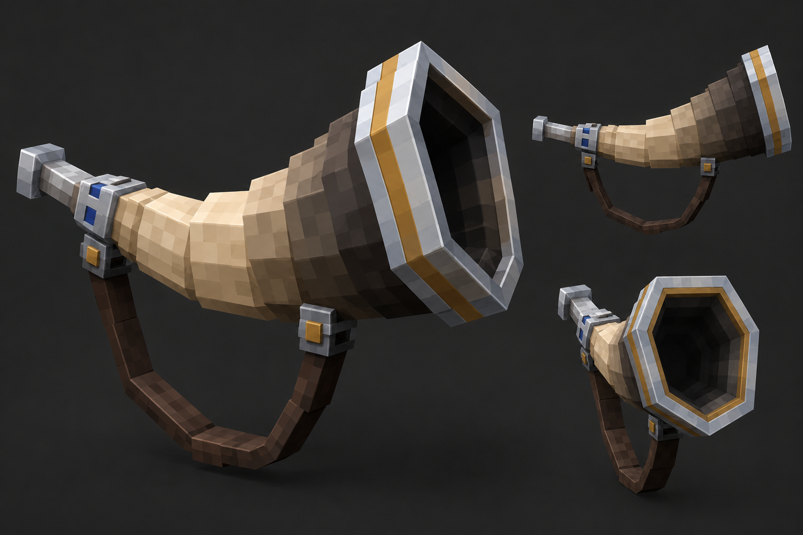

The rebuild preserves the long silver mouthpiece, cream-to-dark-brown body, broad octagonal opening, silver/gold band, blue neck insets, and hanging loop with two riveted fittings. Its body taper and curved leather are discrete cube steps, and its material painting is a 64×64 atlas. Those are the deliberate translations from the concept into the Java item format. The approved concept itself is outside the runtime pack.

The runtime files are:

- `src/assets/legendcraft/items/classes/knight_horn.json`
- `src/assets/legendcraft/models/item/classes/knight_horn.json`
- `src/assets/legendcraft/textures/item/classes/knight_horn.png`

The source and screenshots are explicitly tracked in this pack branch, as requested by the brief's single-worktree, single-PR deliverable. They are outside `src/` and do not enter the pack zip.

## Palette and paint

The texture uses discrete pixel clusters and plane shading, without gradients or noise. Sixteen atlas tiles carry material studies and shared ramps; face UV sizes follow physical dimensions to keep the paint legible. Five successive bone materials move from ivory to dark smoke. The bell interior and mouthpiece bore use dark smoke tones to preserve depth at item scale.

| Material | Principal colours |
|---|---|
| Polished silver | `#EAF0F7`, `#DCE3EC`, `#A8B6C8`, `#77889E`; isolated white edge glints |
| Heraldic gold | `#E0BA61`, `#C49A3A`, `#A07B2D`, `#7C5C24` |
| Blue enamel | `#326DBA`, `#1F5FB0`, `#184780`, `#10335C` |
| Ivory | `#F1E2C1`, `#E1CEA8`, `#CAB58F`, `#AF9875` |
| Cream bone | `#E3CCA5`, `#D0B78F`, `#B89D76`, `#9C825F` |
| Umber bone | `#C9AE86`, `#B29772`, `#927B5E`, `#79654E` |
| Smoke bone | `#A18B6D`, `#88765E`, `#6D5E4D`, `#564B40` |
| Dark bell | `#786B59`, `#62574A`, `#4F473D`, `#3D3831` |
| Dark leather | `#73553D`, `#5B402E`, `#453024`, `#30231C` |
| Interior | `#494038`, `#352F29`, `#24211E`, `#171615` |
| Fitting bases | `#8091A4`, `#617184`, `#435266`, `#2D3949` |

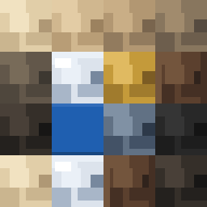

## Display starting points

Rotations are degrees, translations are Java display units, and scales are multipliers. These are the exported values. Both hand poses were reoriented for the approved curve and hanging loop; first-person scale was reduced slightly to keep the loop within the preview.

| View | Rotation x, y, z | Translation x, y, z | Scale x, y, z |
|---|---|---|---|
| `firstperson_righthand` | −53.11, −73.49, −15.99 | 3.11, 4.23, 0.68 | 0.65, 0.65, 0.65 |
| `firstperson_lefthand` | −53.11, −73.49, −15.99 | 3.11, 4.23, 0.68 | 0.65, 0.65, 0.65 |
| `thirdperson_righthand` | 5, −30, 0 | −3.07, 2.57, 3.69 | 0.85, 0.85, 0.85 |
| `thirdperson_lefthand` | 5, −30, 0 | −3.07, 2.57, 3.69 | 0.85, 0.85, 0.85 |
| `gui` | 15, −120, 0 | −4.99, 2.61, 0 | 1.10, 1.10, 1.10 |
| `ground` | 0, 0, 0 | 0, 2, 0 | 0.60, 0.60, 0.60 |
| `fixed` | 0, 90, −35 | 0, −1, −1 | 0.80, 0.80, 0.80 |

The hand slots intentionally store equal numeric transforms. Java's left-hand display application reverses x translation and y/z rotation. Negating these again in the JSON would undo the intended mirror. The asymmetric strap fittings and enamel insets remain on their physical side of the horn.

The GUI translation centres the geometry around its visual bounds instead of its mouthpiece pivot. The enlarged GUI capture uses a preview-camera zoom of 3; that zoom is not an additional item scale. GUI, third-person, ground, and fixed captures use Blockbench's native transparent-margin crop into a 900×750 canvas. First-person captures retain the complete reference viewport.

## Blockbench previews

Captured and inspected in Blockbench 5.2.1, Java Block/Item Display mode. First-person views use the built-in **Horn Tooting** reference (`tooting`) and its use-pose camera. The horn occupies the lower-right for the right hand and lower-left for the left hand, leaving the view centre clear. Canvas screenshots do not include Blockbench's HTML crosshair overlay.

Third-person views use the player reference with a level head, the active arm raised 85°, and 30° of inward yaw. The item attachment receives the same yaw about the shoulder; the other arm is reset to rest. These preview-only changes reproduce the level-head toot stance without adding animation to the asset. The 85°/30° constants correspond to the vanilla biped toot constants in [Fabric's mapped vanilla constant table](https://maven.fabricmc.net/docs/yarn-1.21.4%2Bbuild.8/constant-values.html#net.minecraft.client.render.entity.model.BipedEntityModel.field_39069). This is a Blockbench fit check, not a captured Minecraft client session.

The side camera is `[42,29,-22]`, targeting `[0,22,-5]`. Other third-person views use the Display editor's default camera. Ground uses the block reference and fixed uses the item-frame reference.

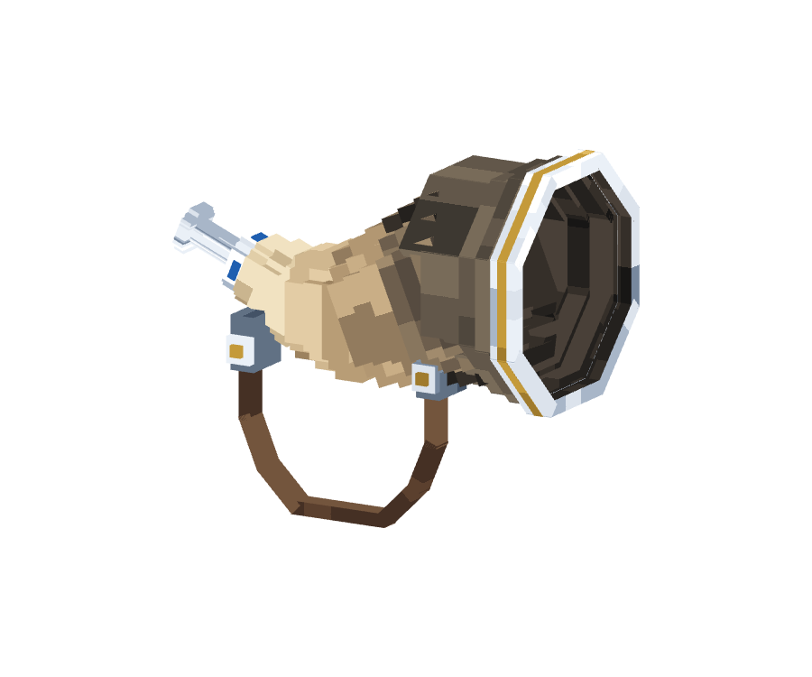

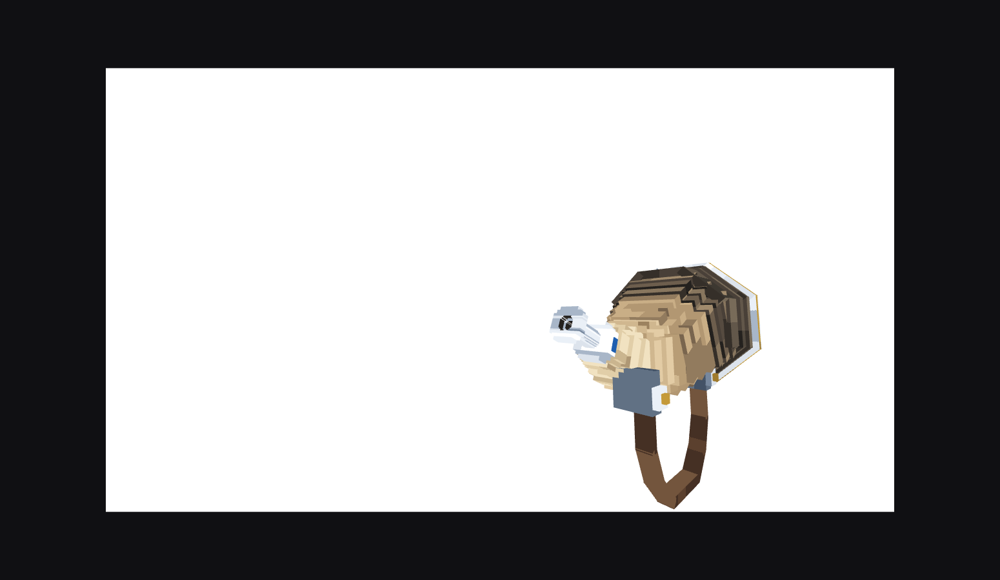

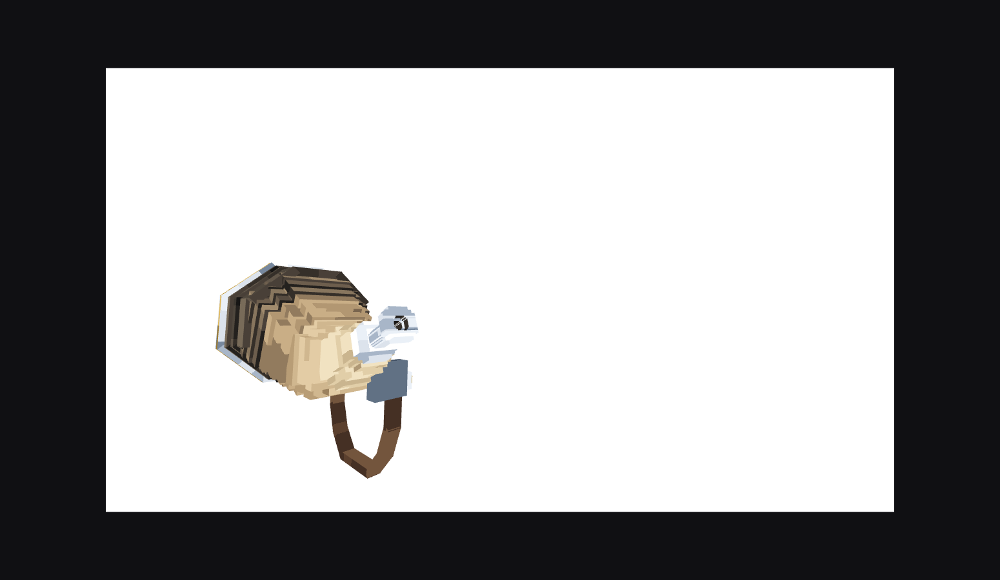

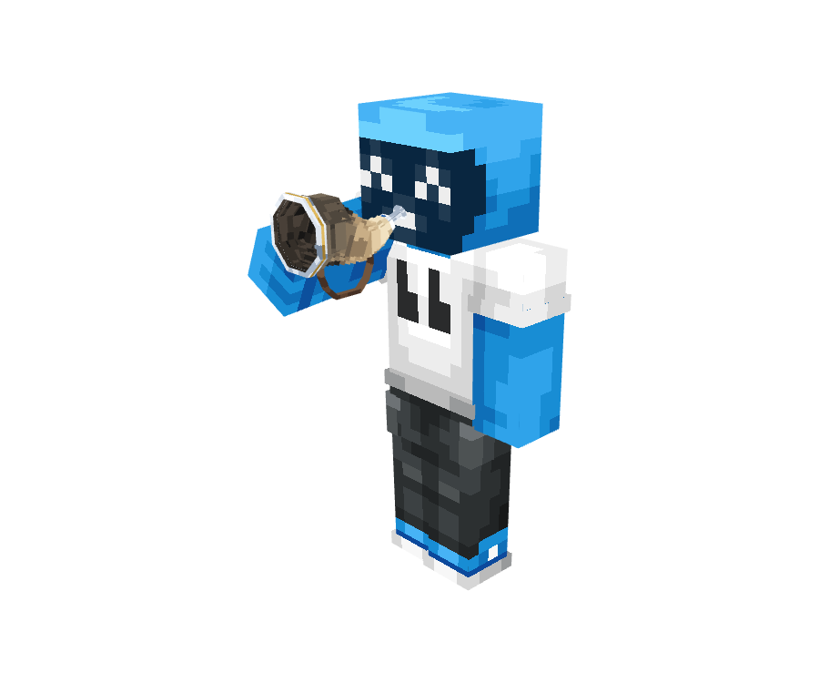

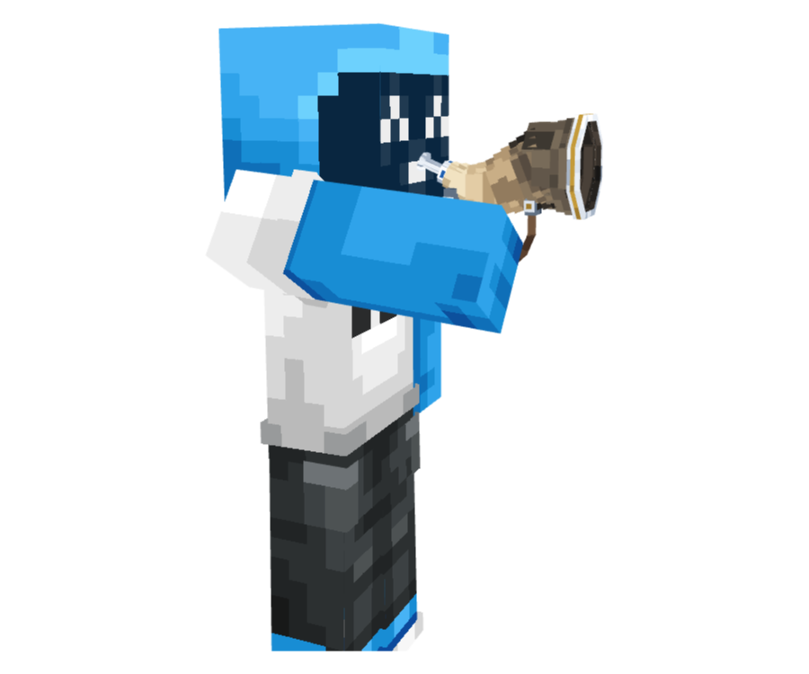

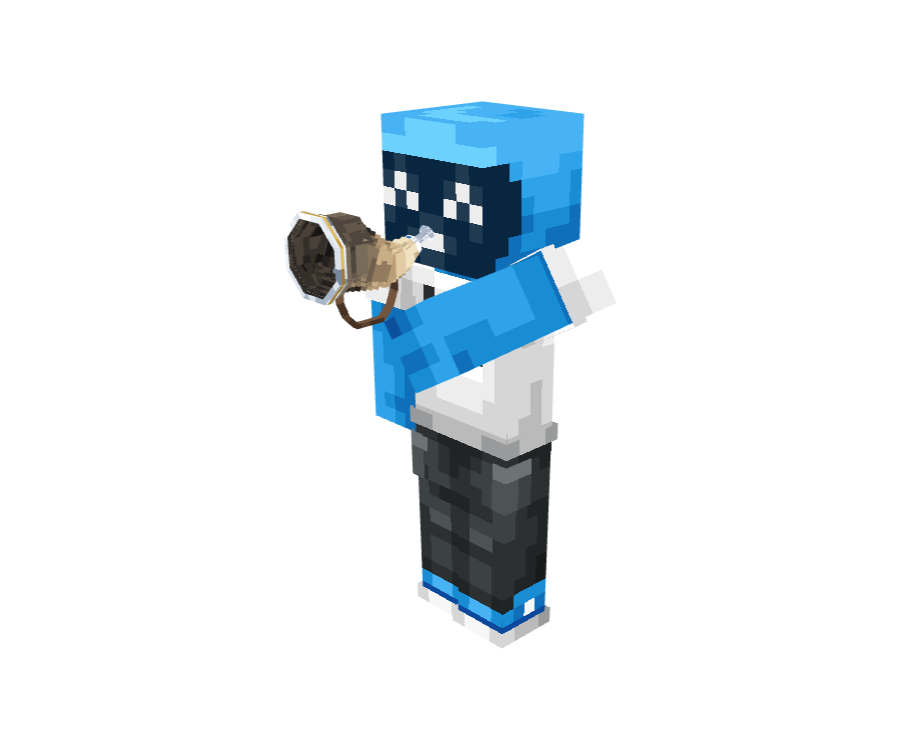

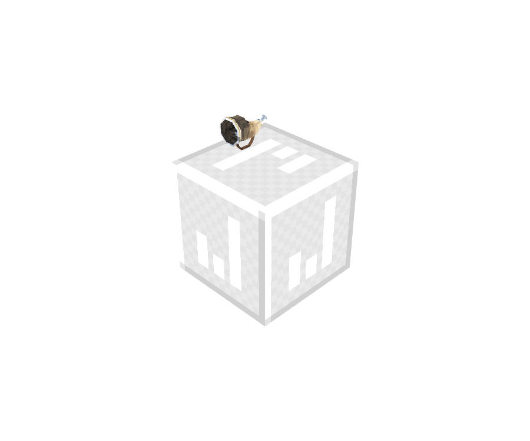

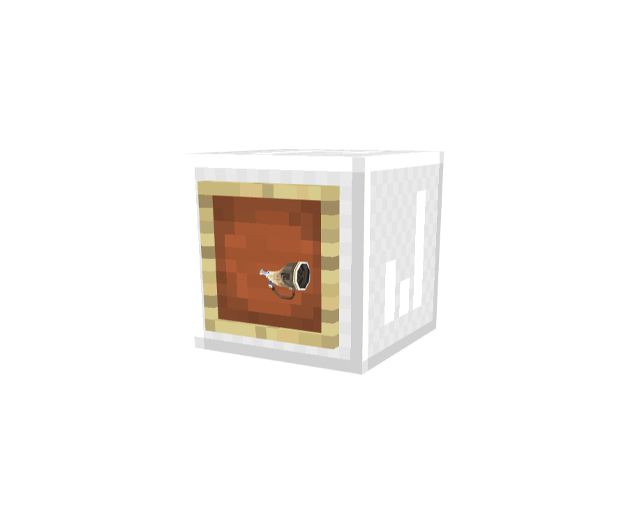

### Vanilla comparison

The unmodified vanilla goat-horn model and texture were extracted from the [official Minecraft 1.21.10 client](https://piston-data.mojang.com/v1/objects/d3bdf582a7fa723ce199f3665588dcfe6bf9aca8/client.jar), opened as a separate Java project, and shown with the same first-person Horn Tooting reference and third-person player stance. Blockbench resolves its `item/generated` parent. Only comparison screenshots are included here; the vanilla assets are not added to the pack.

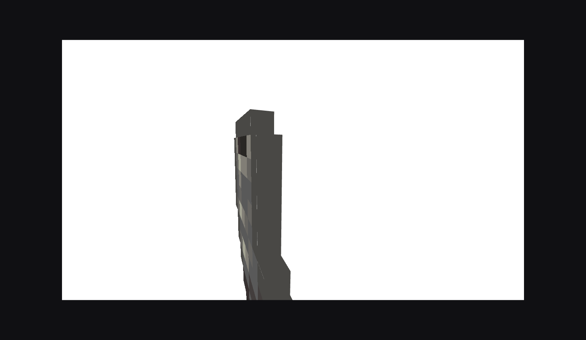

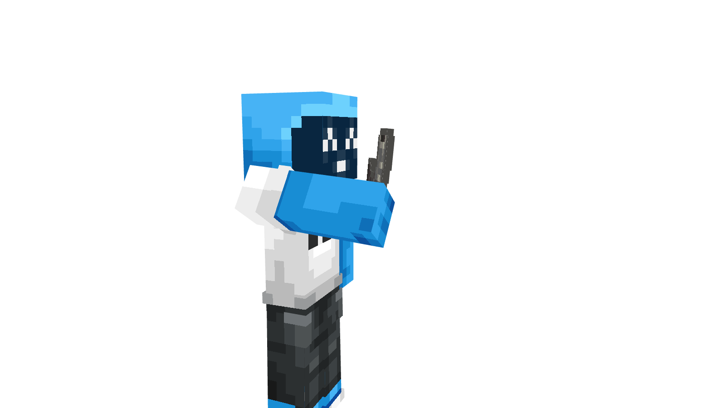

## Verification

2026-09-24, branch `knight-horn`, based on freshly fetched `origin/main` at `d56ded2`.

- Blockbench exported both the `.bbmodel` source and the Java runtime model. Source/model checks passed for all 215 cube bounds, rotations and face UVs, all seven display transforms, and pixel-for-pixel equality between the embedded atlas and the runtime PNG.
- Every element coordinate is within −16..32. All rotations use one legal Java axis/angle. One 64×64 texture resolves through `legendcraft:item/classes/knight_horn`; all faces reference it. No source texture path points at this machine.
- `python tools/test_pack_manifest.py`: **5 tests passed**.
- `pwsh -NoProfile -File build.ps1`: **passed**, producing `dist/LegendCraft-Pack-0.2.4.zip`, approximately 775.4 KB. `VERSION` advances from 0.2.3 to 0.2.4 for the new asset; the rebuilt draft retains 0.2.4 because it has not been released.
- Pack SHA1: `2e6998165c99a03d2c9c8515c5958425f22d065a`.
- `python tools/check_pack_manifest.py --pack dist/LegendCraft-Pack-0.2.4.zip --source-tree src`: **passed**, carrying 218 item models, 8 sounds, and 1 `sounds.json`. Plugin-contributed inputs are reported **unchecked** because this is the base-pack build and no plugin source zip was provided.
- Zip entries for the horn item definition, element model, and texture were each checked byte-for-byte against `src/`.

### Body-join repair

The owner identified gaps along the body joins after the concept rebuild. A temporary monochrome render probe reproduced actual see-through openings where the 22.5° smoke flare meets the straight terminal bell. The terminal walls originally began at an axial plane that stopped short of the tilted body's upper edge. A radial coverage probe missed this: it intersected other surfaces farther inside the horn. The oblique render sweep caught the openings.

Five existing cubes, `dark_bell_step1_1`, `_2`, `_3`, `_7`, and `_8`, now extend backward to overlap the slanted join. Each extension covers the maximum y extent of that wall against the 22.5° joint plane, plus 0.18 units of overlap. The source and runtime model carry the same five coordinate changes. The hollow bell remains open; the texture, cube count, overall bounds, and display transforms are unchanged.

The same Blockbench diagnostic was run before and after the fix: opaque white material, strap/fittings hidden, pitches −45°/0°/45°, and eight yaw angles 45° apart. At each angle a 900×750 transparent-margin capture was checked for enclosed transparent regions larger than two pixels. The original geometry failed in **10 of 24 views, with 18 openings**; the corrected geometry passed with **0 openings in all 24 views**. These are results for the sampled views, not a claim about every possible camera angle. The shaded display renders and pack checks were then refreshed.

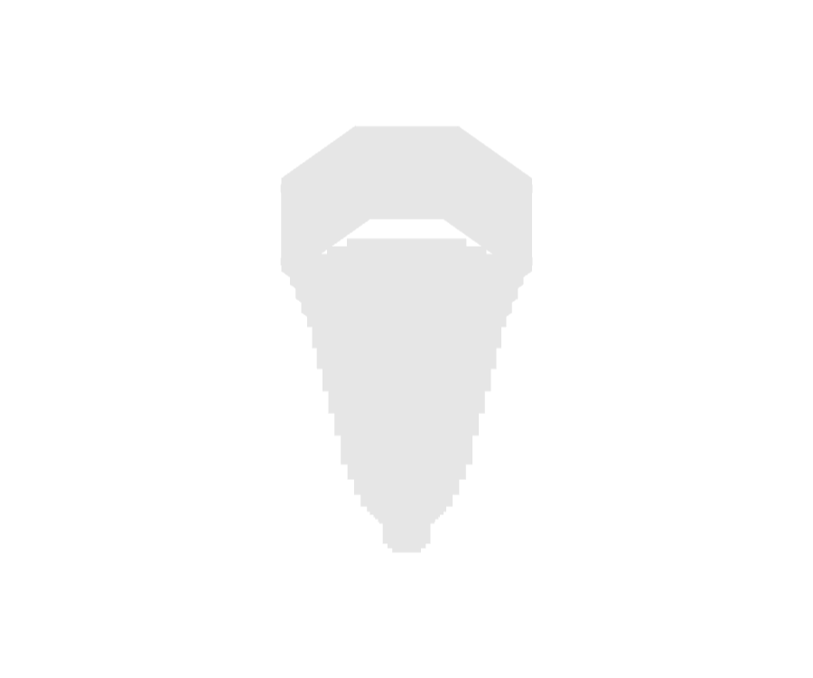

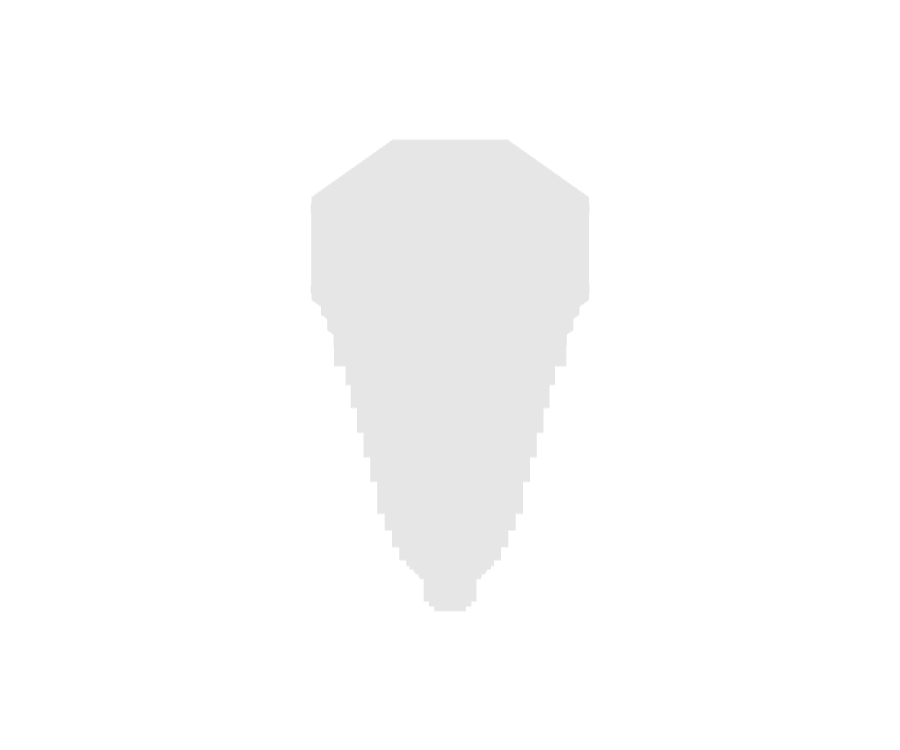

The owner has approved the concept; these updated renders show the resulting model on the same draft PR. The later on-box tune still needs to check mouth contact through the full use action, resting-hand appearance, head pitch/crouching, both player arm widths, actual client FOV, and the bell's crosshair clearance. Plugin integration and deployment are separate later work. This draft has not been merged or deployed.
